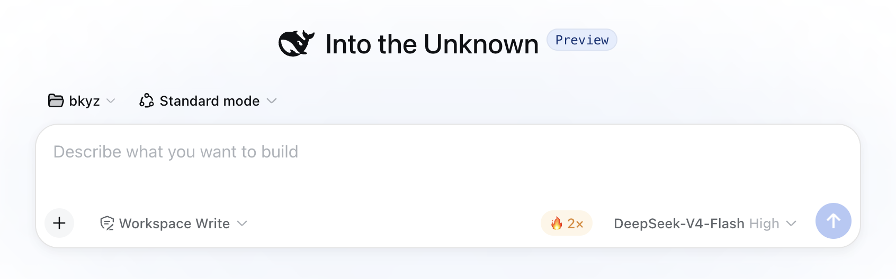

# dsh-me

一个 npm 包装下我的全部 DeepSeek Harness 插件：一次安装、一次升级，每个插件仍可独立启停和配置。

- **一把装齐。** `dsh plugin add` 一条命令装完整包，新增成员只需 `pnpm update`——不用逐个找 repo。
- **独立开关。** 每个成员插件保留自己的 id，profile 层 `cordis.patch.yml` 可单独启停、单独传 config。
- **有测试。** 37 个 vitest 用例，构建产物（`lib/`）直接入库，`link:` 安装即用，无需本地构建。

```sh
dsh plugin --profile web add github:haoliangwu/dsh-me   # 装完重启 web 即生效
```

## 插件

| 插件 | id | 作用 |
|---|---|---|
| peak-rate | `dsh-ui-peak-rate` | 模型命中配置的 provider 且处于高峰计费时段时，在输入框尾部显示 🔥 2× 揽钱提醒 |
| x-opencode-session-shim | `dsh-x-opencode-session-shim` | 给 opencode-go 请求补上 `x-opencode-session`，消除 Console Go 的 400 MissingSessionID |



## 快速上手

1. 安装（远程或本地）：

   ```sh
   dsh plugin --profile web add github:haoliangwu/dsh-me
   # 开发期本地：dsh plugin --profile web add /path/to/dsh-me
   ```

2. 重启 `dsh web`，插件即挂载。

3. peak-rate 需要配置才会显示（shim 零配置，装完即工作）。在 profile 层 `cordis.patch.yml` 按 id 配置：

   ```yaml
   - id: dsh-ui-peak-rate
     disabled: false
     config:
       providers: [deepseek-official]
       peakWindows: [[1, 4], [6, 10]]  # [startHour, endHour) UTC
       multiplier: 2
   ```

## 细节

**结构。** 单包多插件：包根 `cordis.patch.yml` 为每个成员写一条 insert 行（子路径 entry），node 侧各自挂载，client 侧合并为一个 `dsh.client` bundle；`package.json` exports 子路径对应各入口。

**peak-rate。** 高峰窗口 = 工作日 UTC 窗口（周末全天低峰）；窗口外徽章隐藏。providers 列表控制哪些 provider 的模型显示提醒。

**x-opencode-session-shim。** OpenCode Go 要求每个请求携带 `x-opencode-session`（pi-ai ≤0.85.1 不发送）。插件 patch host 进程 `globalThis.fetch`（cordis effect-scoped，卸载即还原），对 `https://opencode.ai/zen/go` 的请求注入当前 dsh 会话 id——agentless 调用回退固定值 `dsh`。每次请求在 host stdout 留一行日志 `[x-opencode-session-shim] opencode-go: x-opencode-session: <id>`，可直接观测发出的值。

## 插件管理

已装插件用 plugin-registry 的薄控制台管理（浏览器面板）：管理 profile 插件安装态（bundle 层栈 + insert 行 + 启停），无需手改配置。安装：

```sh
dsh plugin --profile web add <plugin-registry>/packages/plugin/console
```
